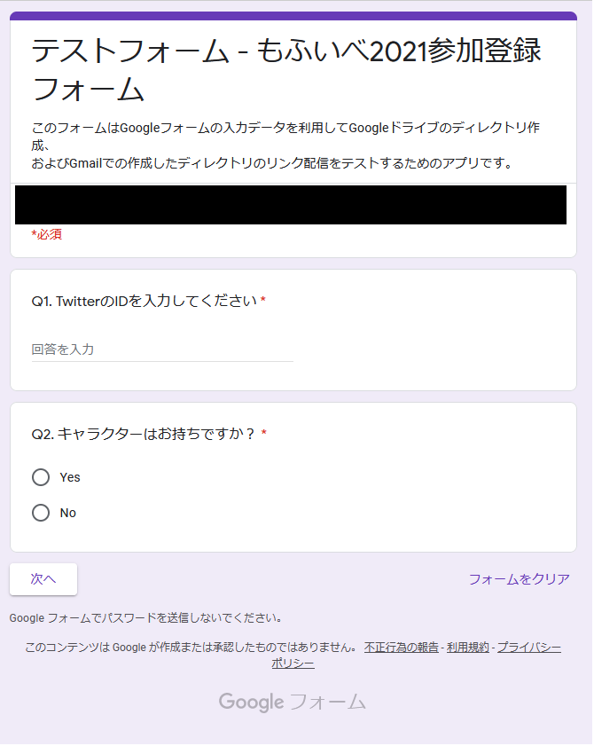
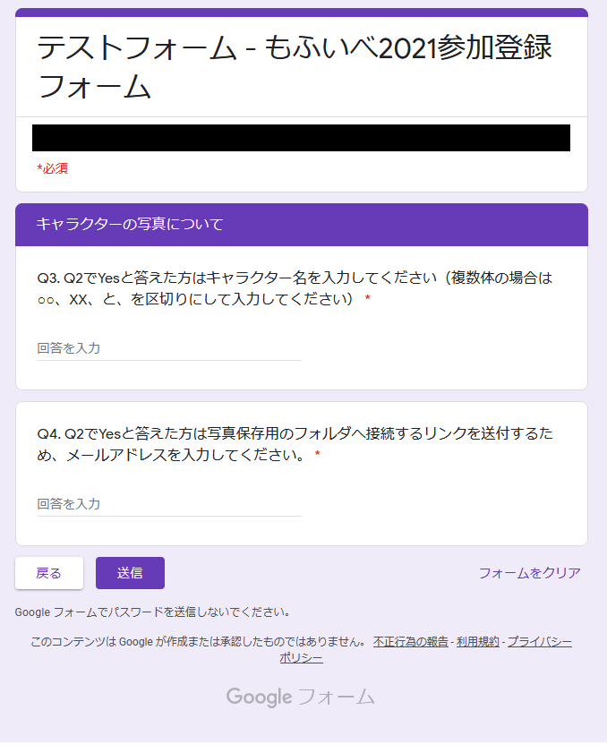
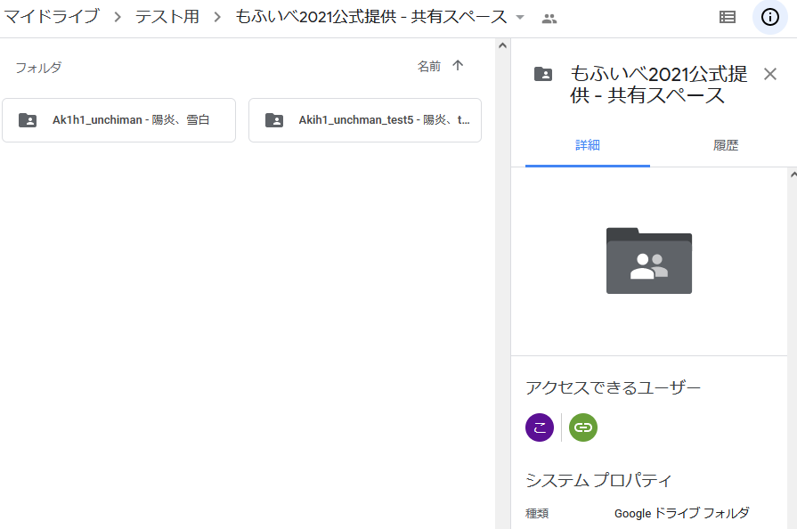
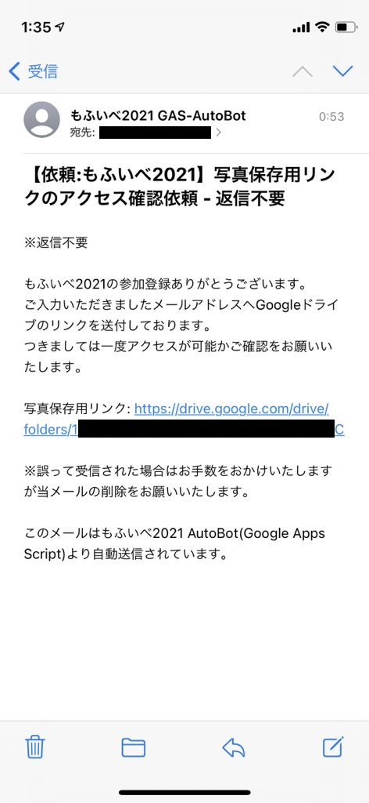

# GAS_AutoCreateDirectory

## 動作説明
Googleフォームで入力されたデータ(twitter ID, ハンドルネームなど)を利用して、
Googleドライブの指定したフォルダの中にその人の名前が入ったフォルダを作成するスクリプトです。
また、フォルダ作成後リンクを送付するためにGmailを使用しています。

### image

こんな感じのフォームを用意します。(Q1~Q4までの簡単なものです)
Q2でNoを選択するとフォルダ作成不要とみなし、フォーム送信へ移ります。

Q2でYesを選択した場合、追加情報入力フォームを入れています。

フォーム送信後、こんなイメージでフォルダが作成されます。

作成完了後、メールでの通知も行います。

## 導入方法
1. フォームを作成した後、右上の「…」からスクリプトエディタを開きます。
   まっさらな状態のスクリプトエディタが開いているかと思いますので、
   mainWorkFlow.gsの内容をすべてコピーしペースト、保存をしてください。

2. 次に、必須項目の質問である下記質問が何番に存在するか確認をお願いいたします。
   「twitter ID、フォルダ作成Yes/No判定、HNやキャラ名、メールアドレス」

3. 26行目(Q1)、18行目(Q2)、29行目(Q3)、32行目(Q4)の[]内の数値を
   2.で調べた番号 - 1 の値を入力してください。

4. 次に、67行目以降に存在するメール送信機能のsubject(タイトル)とbody(本文), optionsの変更をお願いいたします。
   
5. 上記変更を保存し、トリガー項目へ進みます。(時計アイコン)

6. 右下に表示されている「＋ トリガーを追加」を押し、下記のように設定します。
     実行する関数: testFormWorkFlow
     デプロイ: Head
     イベントのソース: フォームから
     イベントの種類: フォーム送信時
     エラー設定: お好みでお願いします
   設定が完了したら保存を押します。

7. 設定は以上になります。

## 意見等
  Twitter: @Ak1h1_unchimanにDM飛ばしていただくのが速いかとおもいますのでよろしくお願いします。
  ソースの改変は自由です。
  いろんなイベントの写真配布の円滑化がこのスクリプトで図れれば幸いです。